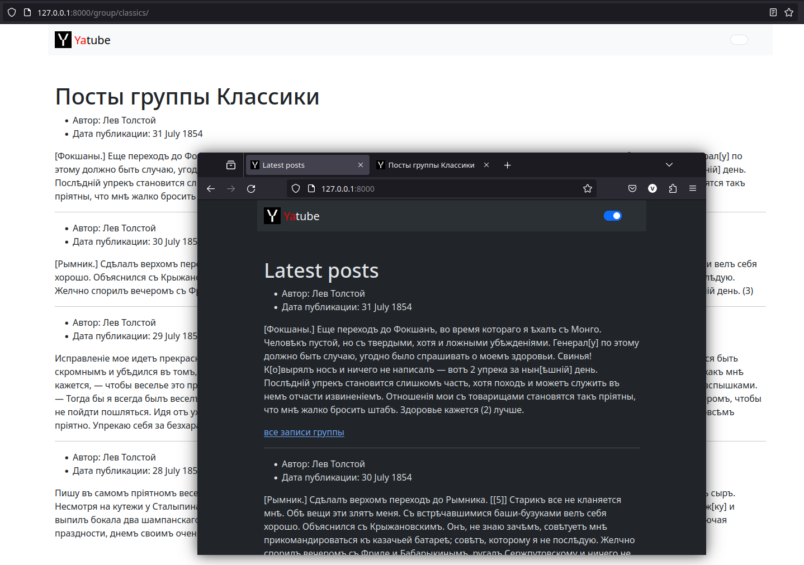

# YATUBE PROJECT 2.0 (SPRINT 3)

### Description
This is a Yandex.Practicum Yatube learning project.

Made with latest Django 5.0.2 and Python 3.11.7

### Launch in Dev mode
- git clone this repo
- activate virtual environment
- install packages from requirements.txt
- and run server from yatube_project_2/yatube directory
- oh, and by the way, you'll need .env file with your SECRET_KEY from
  settings.py :-)

### It will look like this

### Author
Sergey Samoylov
